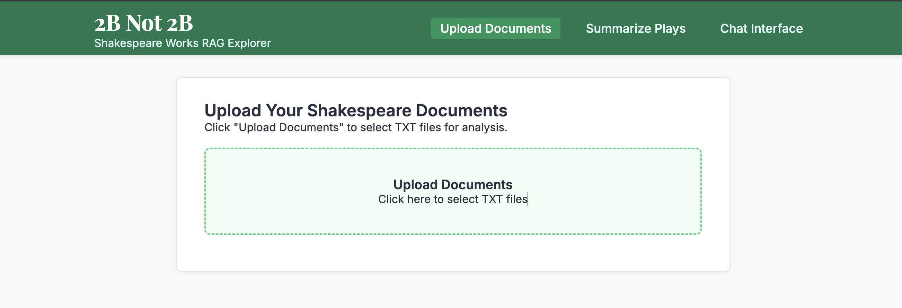
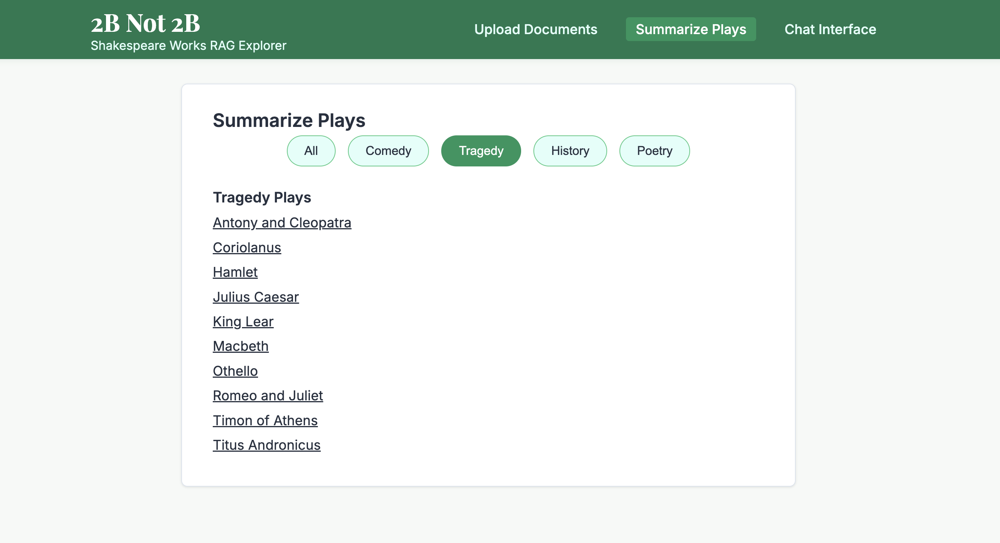
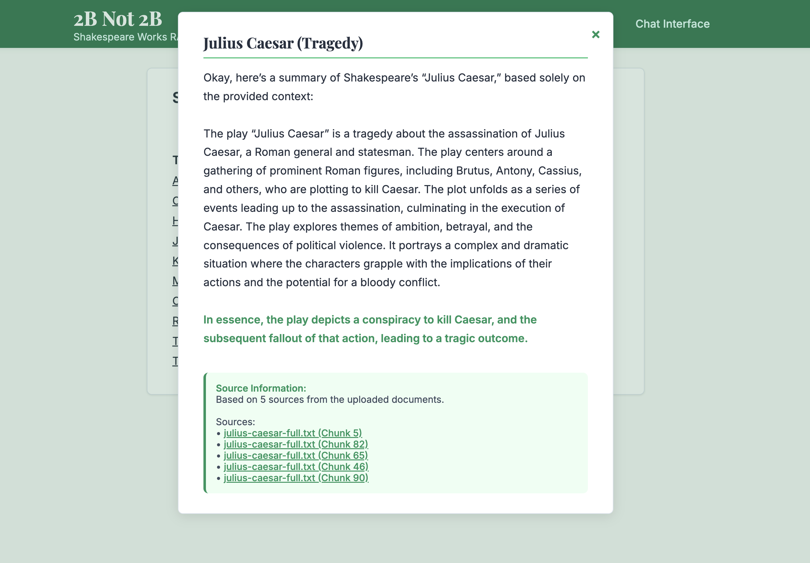
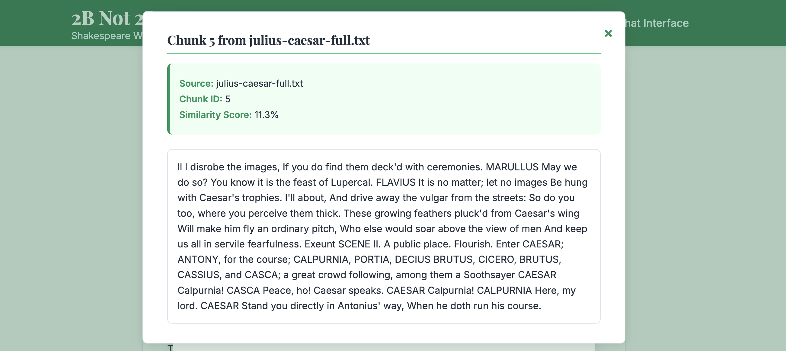
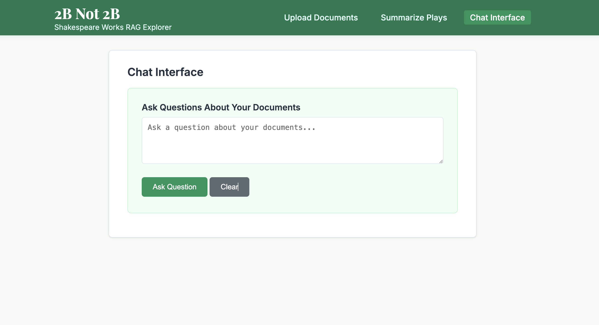

# 2Bnot2B
Local Retrieval-Augmented Generation (RAG) on The Complete Works of William Shakespeare 

# Overview
- Ingest
- Chunk
- Embed
- Store
- Query
- Retrieve
- Generate

# Core Components
- Vector Database
- Embedding Model
- LLM

# Tech Stack
- Docker ( Easy deployment and distribution )
- Ollama ( Running LLM models locally )
- Python with Flask framework for RAG and Web Interface

# Prerequisites 
- [Docker](https://docs.docker.com/get-started/get-docker/)
- [docker-compose-plugin](https://docs.docker.com/compose/install/)

# Running application
Responses are slower with docker with ollama resources
1. Clone 
```bash
git clone https://github.com/joshiujjwal/2Bnot2B.git
cd 2Bnot2B
```
2. Build and run ( Takes some time to pull model etc )
```bash
docker compose up -d
```
3. Navigate to http://localhost:8000 
4. [Upload Documents](http://localhost:8000/#upload)
 - Select input_data/julius_caesar/julius-caesar-full.txt file
   
5. [Summarize Plays](http://localhost:8000/#plays)
 - Select Tragedy > Julius Caesar
   
 - Summary Modal
   
 - Chunk Modal
   
6. [Chat](http:/localhost:8000/#chat)
 - Ask/type question 
   
 

# Key Design TradeOff
## Document Processing 
1. Chunk Size and Overlap for storing data
    - Current 1000 Larger Size more context, less precision
    - Overlap 200 

## Vector Database and Embeddings
1. Using Sentence Transformers to convert text to fixed size vectors
    - Using pretrained model all-MiniLM-L6-v2
    - Lightweight for Local apps not accurate as larger models or APIs
2. Vector storage for data Chroma

## Retrieval
1. For a given query, retrieve documents from vector data based on similarity search
2. With using metadata can show source for response

## LLM Integration
1. Using Gemma3n model
 - Tried couple issues current local resources, 
2. Using a standard prompt to test flow and sources currently using all relevant top 5 docs, can optimise on similarity score if large docs
3. Model Options
 - Temperature 0.7 randomness in text generation
 - Top_p 0.5 for focused response
 - Max_tokens 500 For short response can be configurable in UI

 ## For UI
 - Upload Documents
 - Intearctive Summary for The Complete Works of William Shakespeare based on category
 - Chat Interface for additional questions
 - In Response, added Source and its chunks retrival for text source
 - Theme Green based on The term "green-eyed monster" from Othello, referencing jealousy, highlights Shakespeare's use of green in the context of human emotions.

 ## Notes
 - No RAG background
 - Understood from YT and LLM Chats
 - Used Cursor for code generation assistance

 ## Additional Features
 - Option to select models from UI or compare between models
 - Already pre setup data from plays
 - Unit tests for flask/rag implementation
 - Support of better embedding and LLM via APIs
 - Service status for OLLAMA in UI
